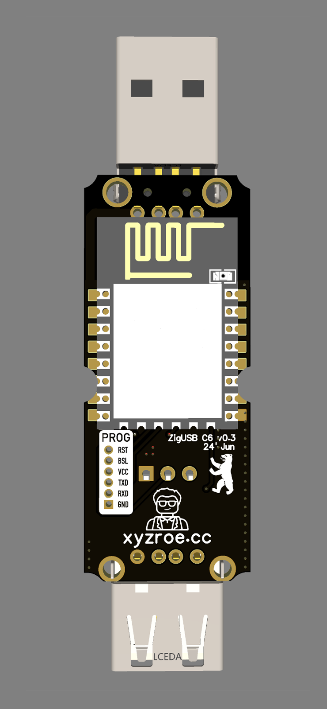

<div align="center" style="display: flex; flex-wrap: nowrap; justify-content: center; align-items: center;"> 
    <a href="https://github.com/xyzroe/ZigUSB_C6/releases"></a>
    <a href="https://github.com/xyzroe/ZigUSB_C6/actions/workflows/build.yml"></a>
    <a href="https://github.com/xyzroe/ZigUSB_C6/releases/latest"></a>
    <a href="https://github.com/xyzroe/ZigUSB_C6/issues"></a>
</div>

The ZigUSB C6 project is an innovative solution designed to enhance the control and monitoring of USB-powered devices through Zigbee communication. This project aims to provide a seamless integration for smart home enthusiasts and professionals alike, enabling remote control, automation, and monitoring of USB devices in a Zigbee-enabled ecosystem. 

This project is based on the original ZigUSB but uses a modern chip and custom-developed firmware.

Using this device, you can remotely control the power of the USB port to turn on or off the connected device. Additionally, you can monitor the current voltage and current. It also functions as a reliable Zigbee network router.

Frequent use cases include converting a "dumb" USB lamp into a "smart" one, connecting modems/sticks/adapters that sometimes require a power reset, and monitoring the current consumption of any connected device.

### Key Features

- **USB Power Control**: Remotely manage the power supply to USB devices, allowing for energy savings and enhanced device management.
- **Zigbee Integration**: Fully compatible with Zigbee networks, facilitating easy integration into existing smart home setups.
- **OTA Updates**: Support for Over-The-Air (OTA) firmware updates, ensuring the device remains up-to-date with the latest features and security enhancements.
- **USB data transfer** is available. This may be needed when connecting a USB modem to a router that does not know how to manage USB power, and the modem may need to be rebooted.
- Monitoring of voltage and current - INA219 chip.
- For power management,  USB switch - AP22804AW5-7 chip.
- WT0132C6-S5 module ​​was used as the Zigbee chip. It's ESP32 C6 based module. 
- Designed for AK-N-12 case.
  
#### To re-pairing or reset to factory defaults:  
 **Hold touch button for more than 5 seconds** 

### Project Goals

ZigUSB C6 was created with the vision of making smart home automation more accessible and versatile. By providing a bridge between USB devices and Zigbee networks, it opens up new possibilities for device automation and control. Whether you're looking to remotely manage lighting, charge devices on a schedule, or integrate USB devices into complex automation routines, ZigUSB C6 offers the flexibility and reliability needed for modern smart homes.

Stay tuned for updates as we continue to expand the capabilities of ZigUSB C6, and feel free to contribute to the project or suggest new features through our GitHub repository.
  
### Overview  
  
<div align="center">


</div>

### Photos

<div align="center">


</div>

### Schematic
<div align="center"></div>
  
#### zigbee2mqtt overview

<div align="center">


</div>

#### Home Assistant overview

<div align="center">

</div>

#### OTA

##### zigbee2mqtt

1. Put firmware update (.*ota) file next to config file 
2. Create `index.json` file:
```
[
    {
        "url": "ZigUSB_C6.ota",
        "force": true
    }
]
```
3. Add config option to you zigbee2mqtt configuration.yaml file
```
ota:
  zigbee_ota_override_index_location: index.json
```
4. Open OTA tab in z2m and click check update next to your device.
5. Check update process via web UI
   
##### homed

1. Put firmware update (.*ota) file to "ota" folder next to config file 
2. Open device page and click OTA button
3. Click refresh and then update


### Hardware files

- [iBOM page](./hardware/iBOM.html) 🌍
- [BOM file](./hardware/BOM.csv) 📃
- [Gerber zip](./hardware/Gerber.zip) 🗂

This work is licensed under a <a rel="license" href="http://creativecommons.org/licenses/by-nc-sa/4.0/">Creative Commons Attribution-NonCommercial-ShareAlike 4.0 International License</a>


### Firmware Files
All source files are available in this repository. Pre-built firmware files can be found in the [releases section](https://github.com/xyzroe/ZigUSB_C6/releases).

### Verified Supported Zigbee Systems
- [zigbee2mqtt](https://www.zigbee2mqtt.io/) - Full support, still requires [external converter](https://github.com/xyzroe/ZigUSB_C6/tree/main/external_converter/ZigUSB_C6.js) ⭐⭐⭐⭐⭐
- [HOMEd](https://wiki.homed.dev/page/HOMEd) - Partial support ⭐⭐⭐⭐
- [ZHA](https://www.home-assistant.io/integrations/zha/) - Partial support ⭐⭐⭐⭐


### Where to buy?
<a href="https://www.tindie.com/stores/mind/?ref=offsite_badges&utm_source=sellers_xyzroe&utm_medium=badges&utm_campaign=badge_large"></a>


### Like ♥️?
[](https://www.buymeacoffee.com/xyzroe) 
[](https://github.com/sponsors/xyzroe)
[](http://paypal.me/xyzroe) 

### Contribute 🚀
- [How-to](./CONTRIBUTE.md) 

<br>  
ZigUSB_C6 is licensed under the <a rel="license" href="http://creativecommons.org/licenses/by-nc-sa/4.0/">Creative Commons Attribution-NonCommercial-ShareAlike 4.0 International License</a>
